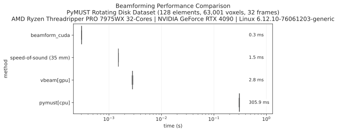
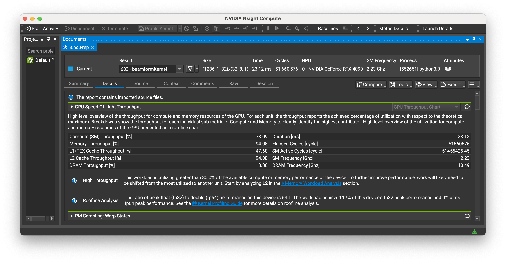
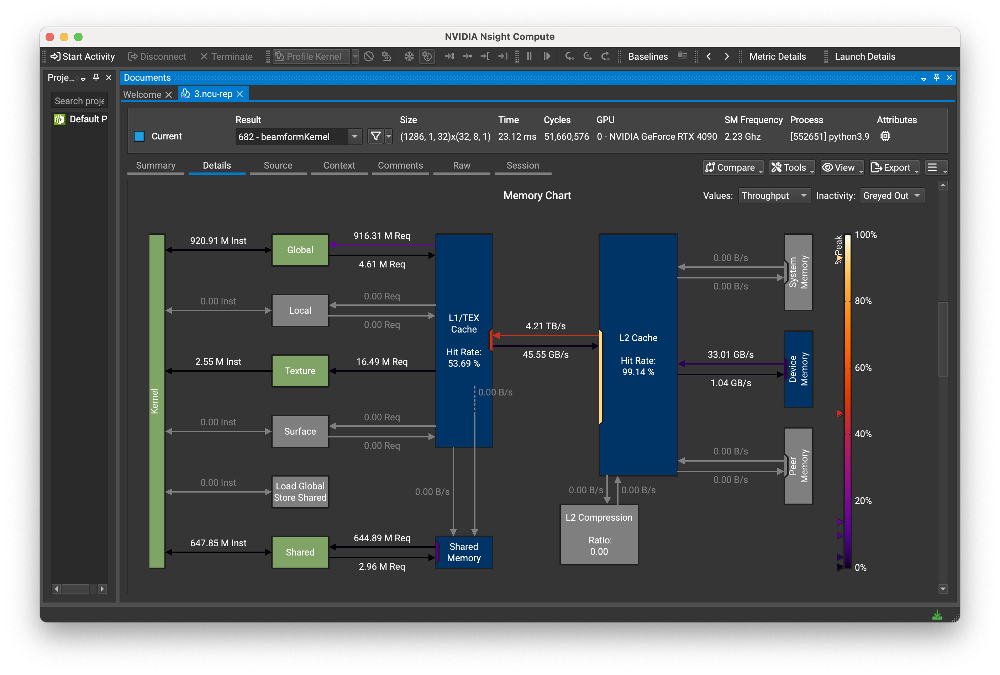
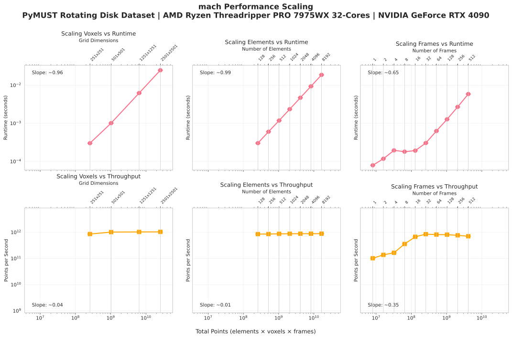

# Performance Benchmarks

## Methodology

### Test Environment

- **Python**: 3.11
- **GPU**: NVIDIA GeForce RTX 5090
- **CPU**: Intel Core Ultra 9 285K
- **OS**: Linux 6.11.0-29-generic

### What We Measure

**Kernel Performance Only**: All benchmarks measure only the core delay-and-sum beamforming kernel execution time. We explicitly **exclude**:
- CPU↔GPU memory transfers (depends on PCIe bandwidth, motherboard, etc., and pre-/post-processing steps may keep data on the GPU)
- JIT compilation (amortized over multiple function-calls)
- Data format reshaping (varies by scanner or file format)
- Pre-processing and post-processing steps (bit-unpacking, demodulation, clutter filtering, etc.; varies by ultrasound sequence)

The benchmark focuses on the most compute-/memory-bandwidth-intensive part of beamforming rather than system-specific overheads.

### Benchmark Dataset

We use PyMUST's [rotating-disk Doppler dataset](https://github.com/creatis-ULTIM/PyMUST/blob/170ba68/examples/rotatingDisk_real.ipynb) as our primary benchmark:

- **128 receive elements** (L7-4 linear array)
- **63,001 voxels** (25mm × 25mm grid, 0.1mm spacing)
- **32 frames** (temporal ensemble)

This represents a realistic ultrafast imaging workload, although it is a small microbenchmark compared to the 3D, high-channel count datasets we're actually interested in.

The benchmark scripts use the following settings:
* linear interpolation
* f-number: `1.0`

## Performance Results



| Implementation | Median Runtime | Points/Second | "Mach factor" |
|---------------|----------------|---------------|----------------|
| **mach (GPU)** | **0.23 ms** | **1.13 × 10¹²** | **6.5×** |
| Speed-of-Sound (35mm) | 1.5 ms |  | 1× |
| vbeam (JAX/GPU) | 3.6 ms | 7.2 × 10¹⁰ | 0.42× |
| PyMUST (CPU) | 67 ms | 3.8 × 10⁹ | 0.022× |

### What does "beamforming at the speed of sound" even mean?

The **speed-of-sound** ("Mach 1"), represents the theoretical minimum time required for ultrasound waves to travel to the deepest imaging point and back, multiplied by the number of frames in the dataset.
This is specific to each imaging scenario. For our benchmark with PyMUST's [rotating-disk Doppler dataset](https://github.com/creatis-ULTIM/PyMUST/blob/170ba68/examples/rotatingDisk_real.ipynb):

- **Maximum imaging depth**: 35 mm
- **Speed of sound in rotating disk**: 1,480 m/s
- **Round-trip time**: 2 × 0.035 m ÷ 1,480 m/s = 47 μs per frame
- **Total for 32 frames**: 47.3 μs × 32 = **1.5 ms**

mach's processing time depends on various factors (see [Computational Complexity](#computational-complexity)),
so the "Mach factor" description is specific to this benchmark.

## Benchmark Reproduction

All benchmarks can be reproduced using the included test suite:

```bash
# Run full benchmark suite
make benchmark

# Generate performance plots
uv run --group compare tests/plot_benchmark.py --output assets/benchmark-doppler_disk.svg
uv run --group compare tests/plot_benchmark.py --points-per-second --output assets/benchmark-doppler_disk_pps.svg
```

The benchmark job in our CI pipeline ([`test_gpu.yml`](https://github.com/Forest-Neurotech/mach/blob/main/.github/workflows/test_gpu.yml)) automatically runs these benchmarks across different commits, providing continuous performance monitoring.

## CUDA Optimizations

mach optimizes GPU memory access patterns to improve performance. For those interested in learning more about CUDA optimization, excellent resources include:

- [CUDA Crash Course](https://github.com/CoffeeBeforeArch/cuda_programming/) by CoffeeBeforeArch
- [How CUDA Programming Works](https://www.nvidia.com/en-us/on-demand/session/gtcspring22-s41487/) - CUDA Architect presentation on CUDA best-practices
- [Optimizing Parallel Reduction in CUDA](https://developer.download.nvidia.com/assets/cuda/files/reduction.pdf) - NVIDIA example of optimizing a different algorithm

### Key Optimizations in mach

#### 1. **Coalesced Memory Access**
- Channel data organized as `[n_receive_elements, n_samples, n_frames]`
- Frames dimension is contiguous for [coalesced access](https://developer.nvidia.com/blog/how-access-global-memory-efficiently-cuda-c-kernels/) to reduce global memory reads

#### 2. **Pre-computed Transmit Wavefront Arrivals**
- Pre-compute transmit arrival times to amortize delay calculation across repeated kernel calls
- However, cannot pre-compute the full transmit+receive delay matrix (like PyMUST) for large datasets: (would require transmits × voxels × channels x `size(float)` memory)

#### 3. **Shared Memory for Delay Tables**
- Transmit-to-receive delays computed only once per voxel (not 32× for 32 frames)
- Delay and apodization tables cached in shared memory
- Reused across all frames for each voxel

### Memory Bandwidth and Compute Utilization

The current thread-block and L1-cache parameters were selected for an [RTX4090 (Blackwell)](https://images.nvidia.com/aem-dam/Solutions/geforce/blackwell/nvidia-rtx-blackwell-gpu-architecture.pdf). These should work well across [Blackwell Architecture GPUs](https://images.nvidia.com/aem-dam/Solutions/geforce/blackwell/nvidia-rtx-blackwell-gpu-architecture.pdf).

If you're wondering if different thread-block or L1-cache parameters might be better for your specific GPU, [Nsight Compute](https://developer.nvidia.com/nsight-compute) can be helpful to identify bottlenecks.



*Figure: Nsight Compute profiling results shows 94% memory throughput and 78% compute throughput for the mach kernel on an RTX4090. (Different dataset)*

> **Note**: These utilization percentages are kernel-specific metrics from Nsight Compute, not the overall GPU utilization shown by `nvidia-smi` or `nvtop`.



*Figure: Example Nsight Compute memory workload analysis. (Different dataset)*

Anecdotally, kernel-duration seems to hit a pareto-optimum at >70% memory+compute-efficiency. Changing parameters at that point tends to trade-off memory/compute in a way that doesn't change the overall kernel-time.

## Scaling Performance

(computational-complexity)=
### Computational Complexity

The beamforming algorithm scales as:
```
O(n_voxels × n_elements × n_frames)
```

For the PyMUST dataset: `63,001 voxels × 128 elements × 32 frames ≈ 2.6 × 10⁸` points

### GPU Memory (VRAM) Usage

mach allocates GPU memory only for input arguments and the output result; no intermediate arrays are created during computation, simplifying memory management.

Total GPU memory usage scales as:
```
O(n_voxels × n_frames + n_elements × n_samples × n_frames)
```

Where:
- **First term** (`n_voxels × n_frames`): Output array size—dominates for large imaging grids
- **Second term** (`n_elements × n_samples × n_frames`): Input data size—dominates for high-channel-count systems

#### Memory Usage Example

Here is an example functional ultrasound imaging (fUSI) workload:
- **Imaging grid**: 100×100×100 voxels (1M points)
- **Temporal frames**: 200 frames
- **Matrix probe**: 1024 elements
- **Samples per channel**: 100
- **Data type**: `complex64` (8 bytes per sample)

**Memory breakdown:**
```
channel_data:       (1024, 100, 200) → 164 MB
rx_coords_m:        (1024, 3)        → 12 KB
scan_coords_m:      (1M, 3)          → 12 MB
tx_wave_arrivals_s: (1M,)            → 4 MB
out:                (1M, 200)        → 1.6 GB
                                    ─────────
Total GPU memory:                    ~1.78 GB
```

In this example, the output array (`out`) represents 90% of memory usage, demonstrating how large imaging grids dominate memory requirements for volumetric datasets.

### Performance Scaling with Dataset Size

Typical functional ultrasound imaging (fUSI) datasets we're targeting:
- **1024+ receive elements** (high-density arrays)
- **1M+ voxels** (volumetric or high-resolution imaging)
- **100+ frames** (longer temporal windows)

The performance scaling tests measure how mach's beamforming performance scales with different dataset dimensions:

- **Voxel scaling**: Testing grid resolution from 1e-4 (default) to 1e-5 meters (63k to 6.3M voxels)
- **Element scaling**: Testing 1x to 64x receive elements (128 to 8,192 elements)
- **Frame scaling**: Testing 1/32x to 16x ensemble size (1 to 512 frames)

To run the scaling benchmarks and then generate plots:

```bash
# Run pytest-benchmark
make benchmark

# Generate plots
python tests/plot_scaling.py --output assets/benchmark-scaling.svg
```



*Figure: throughput is largely consistent across dataset sizes, except for a small decrease for <16 frames.*

## Performance Suggestions

For Maximum Throughput:

1. **Keep data on GPU**: Use CuPy/JAX arrays to avoid CPU↔GPU transfers
2. **Use sufficient ensemble size**: Use ≥16 frames for complex64 or ≥32 frames for float32 to fully coalesce reads to global memory
3. **Ensure contiguous frame dimension**: The kernel requires frame-contiguous memory layouts.

## Experimental: Inverted-Loop I/Q Kernel and FP16 Storage

Two stacked changes for complex (I/Q) channel data. The first is automatic; the second is an opt-in private API.

### Inverted-loop I/Q kernel

`beamformKernelInvIQ` restructures the inner loops: the receive-element loop is outermost and each thread accumulates four consecutive frames in registers, fetched with 128-bit vector loads. The sample index, bounds check, apodization weight, and phase-rotation `sincos` are computed once per element instead of once per (element, frame), and the serial load-then-FMA chain becomes four independent accumulator streams.

It is dispatched automatically when `channel_data` is complex, `interp_type` is nearest or linear, the array's base pointer is 16-byte aligned, and the innermost stride of `channel_data` both keeps every sample row 16-byte aligned and leaves room for a whole four-frame chunk. float32 (RF) data, quadratic interpolation, and offset views use the original kernel unchanged. `use_inverted_kernel=False` on the `mach._cuda_impl` functions forces the original kernel for A/B comparisons.

The 128-bit loads constrain that stride, not the number of frames you beamform. The two are independent: `channel_data.shape[2]` is the stride and `out.shape[1]` is how many leading frames are beamformed. So a frame count that would otherwise drop to the original kernel keeps the fast path if the acquisition buffer is allocated with a padded stride:

```python
# 129 frames of real data, allocated as 132 so every sample row stays 16B-aligned
chan = cp.zeros((n_rx, n_samples, 132), dtype=cp.complex64)
chan[:, :, :129] = iq
out = cp.zeros((n_scan, 129), dtype=cp.complex64)
nb_beamform(chan, rx, scan, tx_arrivals, out, **kwargs)  # inverted kernel
```

On an RTX 5090 at 1024 channels x 2.1M voxels, padding 129 frames to a stride of 132 this way is about 1.3x faster than beamforming a tight 129-frame buffer, and the padding costs three frames of wasted loads rather than a copy.

Results agree with the original kernel to float32 rounding (maximum relative error about 1e-6, because the summation order differs), so complex outputs that dispatch the inverted kernel are no longer bitwise identical to v0.1.x. That now includes every frame count that is a multiple of 4, where it was previously a multiple of 8.

### FP16 channel-data storage

`mach._cuda_impl.beamform_fp16` takes the complex64 channel data as interleaved float16 (re, im) pairs, passed as a `uint16` view of shape `(n_rx, n_samples, 2 * frame_stride)`. Only the storage format changes: interpolation, apodization, phase rotation, accumulation, and `out` stay float32 / complex64, so no complex32 dtype is needed. Results match `beamform()` to float16 input rounding (maximum relative error about 2e-4). GPU arrays only, and `out` must be zero-initialised by the caller.

```python
import cupy as cp
from mach._cuda_impl import beamform_fp16

chan16 = iq.view(cp.float32).astype(cp.float16).view(cp.uint16)  # once per dataset, 4-40 ms
out = cp.zeros((n_voxels, n_frames), cp.complex64)
beamform_fp16(chan16, rx_coords_m, scan_coords_m, tx_wave_arrivals_s, out,
              f_number=1.0, rx_start_s=0.0, sampling_freq_hz=fs,
              sound_speed_m_s=1540.0, modulation_freq_hz=f0, tukey_alpha=0.5)
```

FP16 storage alone gives no speedup on the original kernel, which is bound by load latency rather than bandwidth. The inverted kernel is bandwidth bound, which is where halving the bytes pays off.

### Results on an RTX A6000

Single GPU (Ampere, 84 SMs, 6 MB L2), 128³ voxels, matrix array with 300 µm pitch, linear interpolation, no apodization, median of 5 runs, native sm_86 code (see below). "IQ-256" is baseband I/Q sampled at f0 with 256 samples per trace; "analytic RF-2048" is complex analytic RF sampled at 40 MHz with 2048 samples per trace (both are complex64, so both use the inverted kernel).

| configuration, batch 128 | original | inverted | inverted + FP16 | speedup |
|---|---|---|---|---|
| 1024 ch, IQ-256 | 645 ms | 404 ms (1.59×) | 324 ms | **1.99×** |
| 1024 ch, analytic RF-2048 | 617 ms | 549 ms (1.12×) | 314 ms | **1.96×** |
| 4096 ch, IQ-256 | 1499 ms | 918 ms (1.63×) | 742 ms | **2.02×** |
| 4096 ch, analytic RF-2048 | 1375 ms | 1220 ms (1.13×) | 748 ms | **1.84×** |

Speedup over the original kernel as the batch (frame count) grows, 1024 channels:

| speedup vs original | batch 32 | batch 64 | batch 128 | batch 256 |
|---|---|---|---|---|
| IQ-256, inverted | 1.14× | 1.54× | 1.59× | 1.59× |
| IQ-256, inverted + FP16 | 1.29× | 1.84× | 1.99× | 1.98× |
| analytic RF-2048, inverted | 1.04× | 1.22× | 1.12× | 0.96× |
| analytic RF-2048, inverted + FP16 | 1.17× | 1.71× | 1.96× | 2.00× |

Inversion alone helps most on short I/Q traces (about 1.6×) and is within 20% of the original on long analytic-RF traces, where the restructured kernel is bandwidth bound. Adding FP16 storage brings both regimes to about 2× from batch 128 upward. Timings drift about 10% run to run with clocks and thermals, so compare ratios within one run. The working set per block grows with the batch, so GPUs with a larger L2 (RTX 4090: 72 MB, RTX 5090: 96 MB) may shift these ratios; `tests/bench_inverted_fp16.py` prints the GPU's L2 size with its results for that comparison.

### Reproducing

```bash
git checkout feat/inverted-iq-kernel
make install-python-dep && make compile   # needs nvcc; CMakeLists.txt targets sm_75/89/90 plus PTX
uv run --group array python tests/bench_inverted_fp16.py --check                          # correctness matrix, ~10 s
uv run --group array python tests/bench_inverted_fp16.py --sweep-batch --json results.json  # ~5 min, ~18 GB free GPU memory
```

`--el 140x40` adds a 5600-channel configuration. The table above was measured with `86` added to `CMAKE_CUDA_ARCHITECTURES` in `CMakeLists.txt`; the default list runs Ampere GPUs on JIT-compiled compute_75 PTX. A Blackwell GPU (RTX 5090, sm_120) runs the compute_90 PTX unless `120` is added, which needs CUDA 12.8 or newer.

## Experimental: Differentiable Beamforming (`mach.autograd`)

`mach.autograd.beamform` wraps the I/Q forward kernel in a `torch.autograd.Function` with a
hand-written vector-Jacobian product, `mach._cuda_impl.beamform_vjp`. For a real loss on the
beamformed image, gradients flow back to

- `channel_data`: the adjoint of delay-and-sum (backprojection), for learned front ends, unrolled
  reconstruction and least-squares inverse problems;
- `tx_wave_arrivals_s`, `scan_coords_m`, `rx_coords_m` through the delays;
- `sound_speed_m_s` and `rx_start_s` when passed as 0-d tensors, for autofocus and calibration;
- `rx_delays_s`, an optional per-element receive delay added to every arrival time (the
  phase-screen aberration model), whose gradient is the per-element sum of dL/dtau. The same
  argument is accepted by `beamform()` and `beamform_fp16()` for every kernel.

The receive aperture, the sample-bounds masks and the Tukey apodization weight are treated as
constants with respect to the geometry (the usual convention for differentiable delay-and-sum).
Nearest-neighbour interpolation has no interpolant slope, so its delay gradients carry only the
phase-rotation term and its `rx_start_s` gradient is exactly zero; quadratic interpolation and RF
(float32) data have no backward pass. The backward kernel runs on the inverted-loop layout
(complex64, nearest/linear, frame stride a multiple of 4), see above.

```python
import torch
from mach.autograd import beamform

c = torch.tensor(1540.0, dtype=torch.float64, device="cuda", requires_grad=True)
tx_arrivals_s = scan_coords_m[:, 2] / c          # plane wave: differentiable through torch
image = beamform(channel_data, rx_coords_m, scan_coords_m, tx_arrivals_s.float(),
                 rx_start_s=0.0, sampling_freq_hz=fs, f_number=1.0,
                 sound_speed_m_s=c, modulation_freq_hz=f0)   # (n_scan, n_frames) complex64
intensity = image.abs().pow(2)
(-(intensity.pow(2).sum() / intensity.sum().pow(2))).backward()   # sharpness autofocus step
c.grad
```

### Backward-kernel structure

`beamformKernelInvIQVJP` keeps the forward's phase one (shared delay/apodization table) and
inverts phase two the other way round: the receive-element loop is outermost and each thread's
four-frame chunks are innermost, so the delay, taps and complex weight are computed once per
element, and the upstream gradient is loaded once per thread when it owns a single chunk (up to
128 frames). Per chunk it either scatters `conj(W) * c_n * g` into the two tap rows of
`grad_channel_data` with atomics, or dots `g` against the interpolated sample and the tap
difference to get `dL/dtau` per (voxel, element). A third phase applies the chain rule from the
block's (voxel, element) table: per-voxel outputs (transmit arrivals, scan coordinates) are reduced
over the elements in shared memory and per-element outputs (element coordinates, receive delays)
over the block's voxels in registers, so each block issues 4 global atomics per voxel and 4 per
element instead of 8 per table entry; the two scalars (sound speed, start time) are reduced per
block in float64.

Both `beamform()` and `beamform_vjp()` accept `stream` (a CUDA stream handle such as
`torch.cuda.current_stream().cuda_stream`; 0 is the legacy default stream) and
`synchronize` (default True: wait for the kernel; False: return as soon as it is queued, GPU arrays
only). `mach.autograd` launches on torch's current stream with `synchronize=False`, so the host
keeps queueing the optimizer step and the next forward while the GPU works.

### Validation

`tests/test_autograd.py` checks against `tests/torch_reference.py`, a vectorised PyTorch
delay-and-sum that mirrors the kernel's aperture, Tukey window, interpolation bounds and phase
rotation, evaluated in float64 with PyTorch autograd for the reference gradients:

| check | agreement |
|---|---|
| forward vs float64 reference (all interpolation / apodization / modulation modes) | max rel. error 7e-5 (float32 phase) |
| dot-product test `<A d, y> = <d, A^H y>` (channel-data adjoint) | rel. error < 1e-4 |
| `grad_channel_data` vs reference autograd | rel. norm error 6e-5 |
| delay / coordinate / sound-speed / start-time gradients vs reference autograd | rel. norm error 1e-4 to 1e-7 |
| `d/dc` and `d/dt0` of a focusing image energy vs central finite differences of the CUDA forward | rel. error 3e-3 and 1e-3 |
| sharpness autofocus on simulated point scatterers, started 60 m/s off | recovers the true sound speed |

`examples/autofocus_sound_speed.py` runs the autofocus on a 128-element simulation
(`--plot` writes the sharpness curve and the images before and after).

### Cost on an RTX A6000

Random I/Q data, random element and voxel clouds with a wide aperture, linear interpolation, Tukey
apodization, median of 3 runs (`tests/bench_autograd.py`). Absolute times depend on how many
elements fall inside each voxel's aperture; the ratios are the useful part.

| configuration | forward | adjoint (channel data) | delay gradients | both |
|---|---|---|---|---|
| 128 ch, 1024 samples, 4 frames, 120k voxels (imaging / autofocus shape) | 3.1 ms | 12.1 ms (3.9×) | 8.0 ms (2.6×) | 12.8 ms (4.2×) |
| 256 ch, 512 samples, 64 frames, 40k voxels | 7.6 ms | 74 ms (9.7×) | 26 ms (3.5×) | 84 ms (11×) |
| 1024 ch, 256 samples, 128 frames, 128³ voxels | 5.0 s | 34.3 s (6.9×) | 10.3 s (2.1×) | 37.8 s (7.6×) |

The channel-data adjoint is bound by its scattered atomics (four float atomics per element, voxel
and frame for linear interpolation). The delay gradients cost two to three times the forward
because they read both taps and `grad_out`; at 64 frames and above that path is compute bound, and
at the 4-frame imaging shape the block-level reduction of the chain-rule atomics halved it (17.6 ms
to 8.0 ms delay gradients, 25.0 ms to 12.8 ms both, same GPU). Only the gradients that autograd
asks for are computed. In an optimisation loop the stream launch without a device synchronize
matters as much: the autofocus iteration of `tests/test_autograd.py`'s focusing problem (80k
voxels, 64 elements, forward + backward + Adam step) takes 4.0 ms instead of 8.0 ms.
