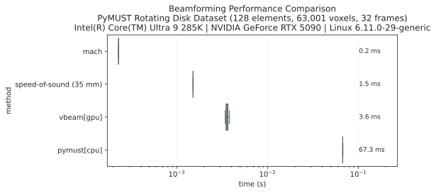

# Performance Benchmarks

## Methodology

### Test Environment

- **Python**: 3.11
- **GPU**: NVIDIA GeForce RTX 4090
- **CPU**: AMD Ryzen Threadripper PRO 7975WX 32-Cores
- **OS**: Linux 6.12.10-76061203-generic

### What We Measure

**Kernel Performance Only**: All benchmarks measure only the core beamforming kernel execution time. We explicitly **exclude**:
- CPU↔GPU memory transfers (depends on PCIe bandwidth, motherboard, etc.)
- Data format conversions and reshaping (varies by scanner or file format)
- Pre-processing steps (bit-unpacking, filtering, demodulation; varies by sequence)
- Post-processing steps (clutter filtering, varies by imaging modality)

The benchmark focuses on delay-and-sum performance rather than system-specific overheads.

### Benchmark Dataset

We use PyMUST's [rotating-disk Doppler dataset](https://github.com/creatis-ULTIM/PyMUST/blob/170ba68/examples/rotatingDisk_real.ipynb) as our primary benchmark:

- **128 receive elements** (L7-4 linear array)
- **63,001 voxels** (25mm × 25mm grid, 0.1mm spacing)
- **32 frames** (temporal ensemble)

This represents a realistic ultrafast imaging workload, although it is a small microbenchmark compared to the 3D, high-channel count datasets we're actually interested in.

## Performance Results



| Implementation | Median Runtime | Points/Second | Speed-up over |
|---------------|----------------|---------------|----------------|
| **mach (GPU)** | **0.3 ms** | **8.56 × 10¹¹** | **1.0× (baseline)** |
| vbeam (JAX/GPU) | 2.8 ms | 9.04 × 10¹⁰ | 9.3× |
| PyMUST (CPU) | 298.4 ms | 8.64 × 10⁸ | 995× |

## Benchmark Reproduction

All benchmarks can be reproduced using the included test suite:

```bash
# Run full benchmark suite
make benchmark

# Generate performance plots
uv run --group compare tests/plot_benchmark.py --output assets/benchmark-doppler_disk.svg
uv run --group compare tests/plot_benchmark.py --points-per-second --output assets/benchmark-doppler_disk_pps.svg
```

The benchmark job in our CI pipeline ([`test_gpu.yml`](https://github.com/Forest-Neurotech/mach/blob/main/.github/workflows/test_gpu.yml)) automatically runs these benchmarks across different commits, providing continuous performance monitoring.

## CUDA Optimizations

mach optimize GPU memory access patterns to improve performance. For those interested in learning more about CUDA optimization, excellent resources include:

- [CUDA Crash Course](https://github.com/CoffeeBeforeArch/cuda_programming/) by CoffeeBeforeArch
- [How CUDA Programming Works](https://www.nvidia.com/en-us/on-demand/session/gtcspring22-s41487/) - CUDA Architect presentation on CUDA best-practices
- [Optimizing Parallel Reduction in CUDA](https://developer.download.nvidia.com/assets/cuda/files/reduction.pdf) - NVIDIA example of optimizing a different algorithm

### Key Optimizations in mach

#### 1. **Coalesced Memory Access**
- Channel data organized as `[n_receive_elements, n_samples, n_frames]`
- Frames dimension is contiguous for [coalesced access](https://developer.nvidia.com/blog/how-access-global-memory-efficiently-cuda-c-kernels/) to reduce global memory reads

#### 2. **Pre-computed Transmit Wavefront Arrivals**
- Pre-compute transmit arrival times to amortize delay calculation across repeated kernel calls
- However, cannot pre-compute the full transmit+receive delay matrix (like PyMUST) for large datasets: (would require transmits × voxels × channels x `size(float)` memory)

#### 3. **Shared Memory for Delay Tables**
- Transmit-to-receive delays computed only once per voxel (not 32× for 32 frames)
- Delay and apodization tables cached in shared memory
- Reused across all frames for each voxel

### Profiling with Nsight Compute

*[Figure placeholder: Nsight compute metrics screenshot]*

## Scaling Performance

### Computational Complexity

The beamforming algorithm scales as:
```
O(n_voxels × n_elements × n_frames)
```

For the PyMUST dataset: `63,001 voxels × 128 elements × 32 frames ≈ 2.6 × 10⁸` points

### VRAM Complexity

GPU Memory usage scales approximately as:
```
O(n_voxels × n_frames + n_elements × n_samples × n_frames)
```

The first term `n_voxels × n_frames` corresponds to output size and dominantes for large imaging grids, while the second term `n_elements × n_samples × n_frames` corresponds to the input data and dominates for high-channel-count systems.

### Performance Scaling with Dataset Size

*[Figure placeholder: Performance scaling with number of voxels]*

*[Figure placeholder: Performance scaling with number of receive elements]*

*[Figure placeholder: Performance scaling with ensemble size (frames)]*

### Memory Bandwidth and Compute Utilization

*[Stub: Detailed analysis of memory bandwidth utilization and compute efficiency using Nsight Compute profiling results]*


*[Analysis of achieved bandwidth and compute utilization to be added]*

## Large-Scale Dataset Performance

### Practical Workloads

*[Stub: Performance analysis on larger, more realistic datasets]*

Typical functional ultrasound imaging (fUSI) datasets we're targeting:
- **1024+ receive elements** (high-density arrays)
- **1M+ voxels** (volumetric or high-resolution imaging)
- **100+ frames** (longer temporal windows)
- **Real-time processing** requirements

*[Figure placeholder: Performance scaling results]*

### Memory Scaling Characteristics

*[Stub: Analysis of memory usage patterns and optimization strategies for large datasets]*

## Performance Optimization Guide

### For Maximum Throughput

1. **Keep data on GPU**: Use CuPy/JAX arrays to avoid CPU↔GPU transfers
2. **Use sufficient ensemble size**: Use ≥16 frames for complex64 or ≥32 frames for float32 to fully coalesce reads to global memory
3. **Ensure contiguous frame dimension**: The kernel requires frame-contiguous memory layouts.
