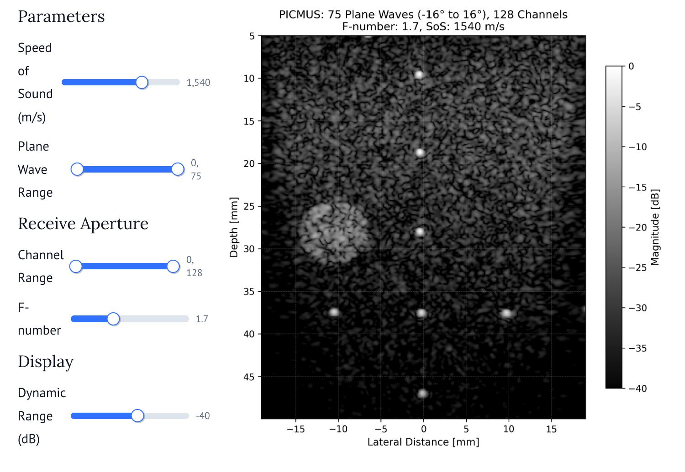

## marimo example

This folder contains interactive examples that can be run with [marimo](https://docs.marimo.io/), an open-source reactive Python notebook.

For example, you can run with:
```bash
# cd mach
uv run marimo run examples/marimo/plane_wave_compound.py
```

And then open up the associated web-browser to adjust beamforming parameters.


